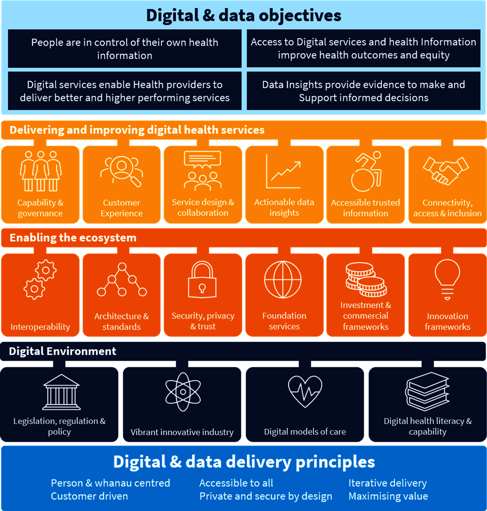
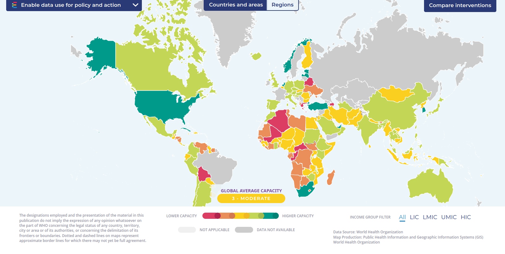
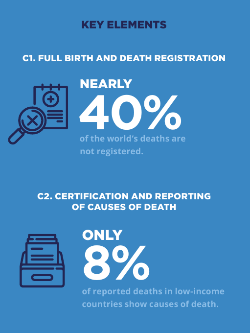
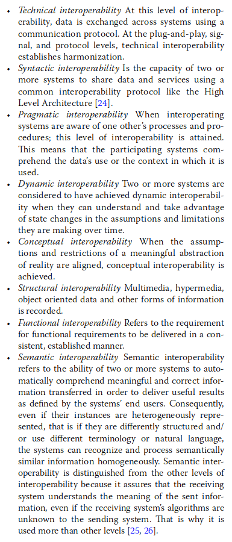
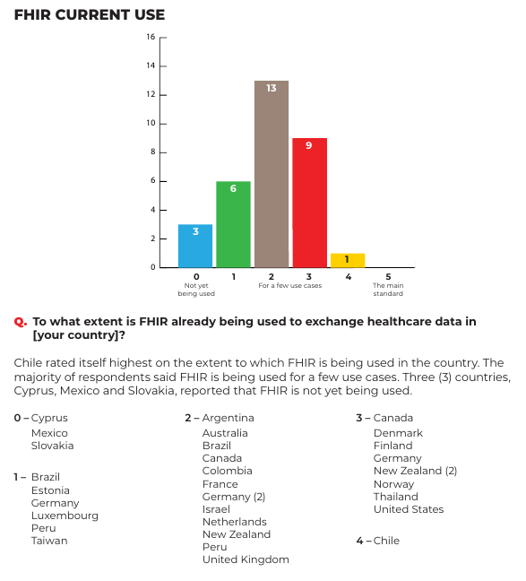
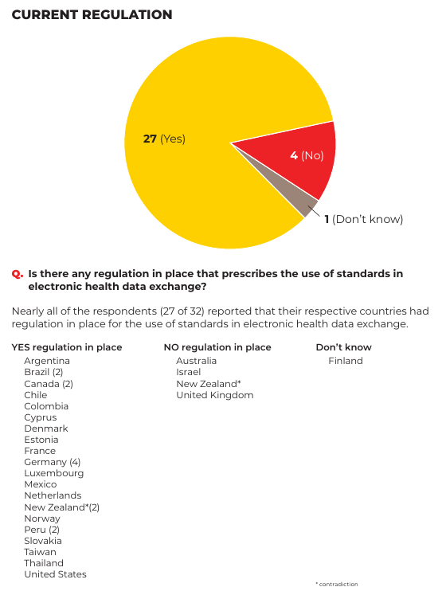
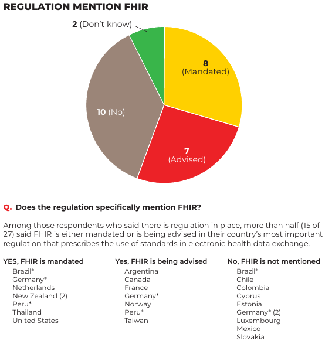
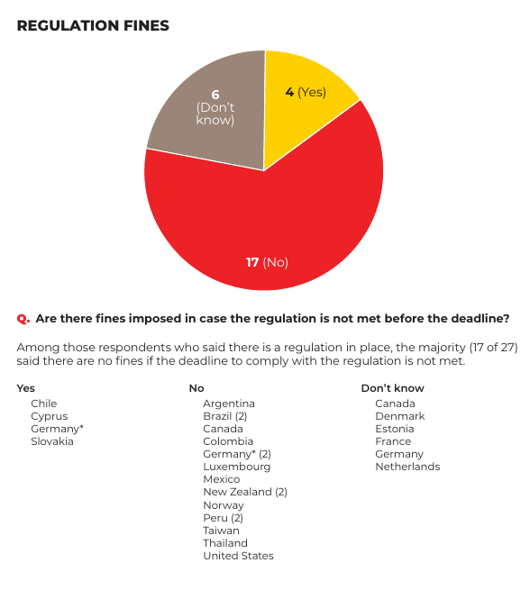
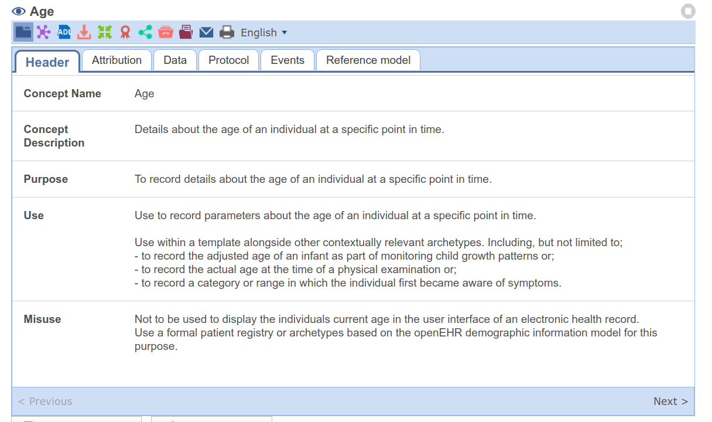

# Future health networks

### Advanced networks presentation

Paolo Marzolo

---

Medical data is hard to handle. But in an emergency, it can be the difference between life and death.

Why is it so difficult to access it?

---

# How it started

- I have a health card in my pocket. If I get in an accident in Italy, can it tell my blood type?
- What about my allergies?
- What about in Japan?

---

Following this thread brought me to

## The sad state of healthcare data handling

Some questions:

- Can Japan access my healthcare data?
- Can a private hospital access my healthcare data? Can I choose what they can see?
- Can I access my healthcare data online?

---

### Every ~~region~~ ~~country~~ ~~network~~ hospital does it their own way

- Complicated to compare
- Some countries do not have a centralized platform to view your medical data/book appointments
- Some countries have nationalized healthcare, others have fractured privatized entities

---

<!-- _class: -->

## Roadmap

1. SOTA: What is the state of healthcare data?
1. EPIPHANY: any kind of inter-country network is currently science-fiction (laws/bureaucracy)
1. USECASE: What would I want in my health data network?
1. DESIGN: What elements do we need to design a system to cover our use cases?

---

This is what a lot of national "data" or "healthcare data strategies" look like.

---

# National data: WHO's SCORE

SCORE was the best national health data index I found.
It addresses availability of timely, reliable, validated and comparable health data to propose:

"Essential interventions, recommended actions, tools and resources that aim to support countries in addressing challenges in meeting health information systems (HIS) needs"

---

# SCORE evaluation

[articulated](https://www.who.int/data/data-collection-tools/score/dashboard#/) in 5 elements (interventions):

- **SURVEY** population and health risks
- **COUNT** births, deaths and causes of deaths
- **OPTIMIZE** health service data
- **REVIEW** progress and performance
- **ENABLE** data use for policy and action

---

<!-- _class: -->

---

Some countries do not collect, publish or use national healthcare data!

---

## But what does this mean for me?

- National healthcare data does not need to be communicated
- As long as the data ingestion policy is more or less agreed upon, the government can achieve perfect SCORE without adopting any common standard
- I want my data to be **shareable** (\*\*\*)

---

### Communication standards

- The Healthcare Information and Management Systems Society (HIMSS), propose conferences to demonstrate healthcare interoperability
- "There are over 40 different SDOs in the health IT arena"

<!-- To be honest, the whole presentation could have been on interoperability challenges -->

---

1/2

## Use Cases

1. Last year, I broke my ankle.
   - Private/public healthcare
   - National/privatized health insurance
   - Private physiotherapy
1. I've had to show I was vaccinated a million times. And when you travel? It's a mess!

---

2/2

## Use cases

3. I got in 2 car accidents in Canada
   - I was 17. Did I know my grandparents' medical history?
   - What if I needed a blood transfusion? Do you know your allergies well enough?
1. I have trust in science research; I want my records to be used, anonymized, for research.

---

## Into Requirements

| Use Case    | Affected Requirements                   |
| ----------- | --------------------------------------- |
| 1-ankle     | Interoperability, Storage               |
| 2-vaccine   | Interoperability, Availability, API     |
| 3-emergency | Interoperability, Availability, Consent |
| 4-research  | Anonymization, API                      |

[Nonfunctional requirements](https://www.altexsoft.com/blog/non-functional-requirements/)

---

## What else?

---

- Privacy and consent
- Security
- Scalability
- Usability (user+clinician+implementer)
- Maintainability

---

<!-- _class: -->

### Interoperability - levels

1. **Foundational**: Securely communicate data
1. **Structural**: Securely communicate interpretable data in shared format and syntax

<!-- - difficulties (IBM page)
- current state (paper)
- how to achieve it (standards, HL7, FIHR..) -->

---

### Interoperability - levels

3. **Semantic**: Common underlying models and codification of the data (standardized definitions, coding vocabularies), providing shared understanding and meaning
4. **Organizational**: Includes governance, policy, social, legal and organizational considerations to facilitate the secure, seamless and timely communication and use of data. (consent, trust and integrated workflows).

---

## Interoperability - HL7 FHIR

- An interoperability standard intended to facilitate the exchange of healthcare information
- Articulated in 2 sections:
  - a content model in the form of ‘resources’ (XML/JSON, extensible)
  - a specification for the exchange of these resources in the form of real-time RESTful interfaces

---

## Interoperability - FHIR - Adoption

- 2016 Obama 21st Century Cures Act "requires EHR systems to provide a patient-facing API to maintain their federal certification"
- FHIR mandatory for those that receive payments for Medicare or Medicaid services
- Adoption level is... surprisingly hard to gauge

---

<!-- _class: -->

---

<!-- _class: -->

---

## Availability

- Overall duration for which the clients can seamlessly access the resources
- 5 nines standard
- Difficulties: connectivity, security... cost
- How to achieve it (redundancy, offline first)
- Reliability...?

---

## Consent/Privacy

- Medical data does not need to be seen in full
- _Digital Twin_ vs _Patient Summary_
- Difficulties: implementation and legality
- How to achieve it

---

## Anonymization

- Healthcare data is under growing pressure for use in data science purposes
- Could you query the entire network, or a subset?
- `k-Anonymization` (generalization, dropping)
- Difficulties: only a dataset is anonymized, explicit regulation is still missing, explicit consent must be given

---

## Security

- The more complete the data, the more valuable it becomes
- The larger the network, the harder to secure
- Luckily, FHIR on HTTP -> SSL/TLS (public-private)
- What's the best way to keep data safe?
- Is E2E relevant?

---

## Why is this magic network not here yet?

- FHIR is not the only possible solution! [OpenEHR](https://wolandscat.net/2016/04/10/openehr-technical-basics-for-hl7-and-fhir-users/) completely different approach
- Limited budgets
- Localized needs
- Legacy systems
- Clinician-focused efforts are lacking

---

# Conclusion

Today, we explored the world of healthcare data and envisioned a bright future which specifically covers all **my** usecases. Then, we evaluated the main pillars that will get us there, and understood why we're not there yet.

---

Some of the sources that lead us here:

- IBM's [page](https://www.ibm.com/topics/interoperability-in-healthcare) on interoperability
- An [overview](https://www.altexsoft.com/blog/non-functional-requirements/) on Non-Functional Requirements
- [Interoperability of heterogeneous health information systems: a systematic literature review](https://www.ncbi.nlm.nih.gov/pmc/articles/PMC9875417/)
- SCORE [home](https://www.who.int/news-room/questions-and-answers/item/score-technical-package)
- HIMSS interoperability [page](https://www.himss.org/what-we-do-initiatives/himss-interoperability-showcase)
- HL7 standard [home](https://www.hl7.org/implement/standards/product_brief.cfm?product_id=185)
- openEHR [dev](https://wolandscat.net/)
- [general](https://kodjin.com/blog/fhir-vs-hl7-key-differences-and-which-is-a-better-choice/) [info](https://fire.ly/blog/fhir-maturity-and-adoption-around-the-world/) [about](https://www.hl7.org/fhir/overview-arch.html)

---

## Good questions you could ask

- Is FHIR the future?
- What about my XXX usecase?
- Who should be in control of the Standard?
- What about AI?

---

# Appendix

openEHR [example](https://ckm.openehr.org/ckm/archetypes/1013.1.3361)

---

<!-- _class: -->

---

# Thanks!
